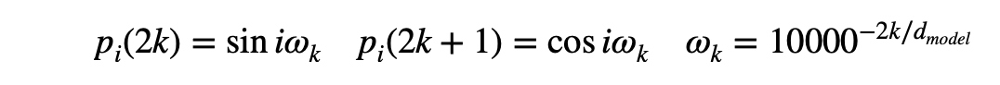
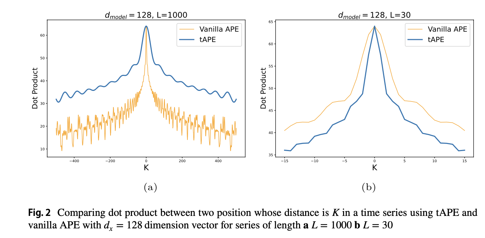
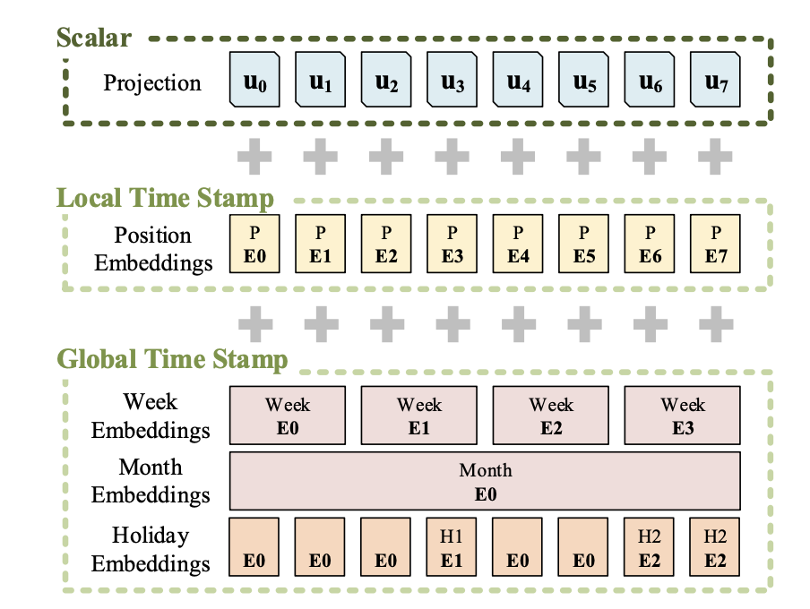
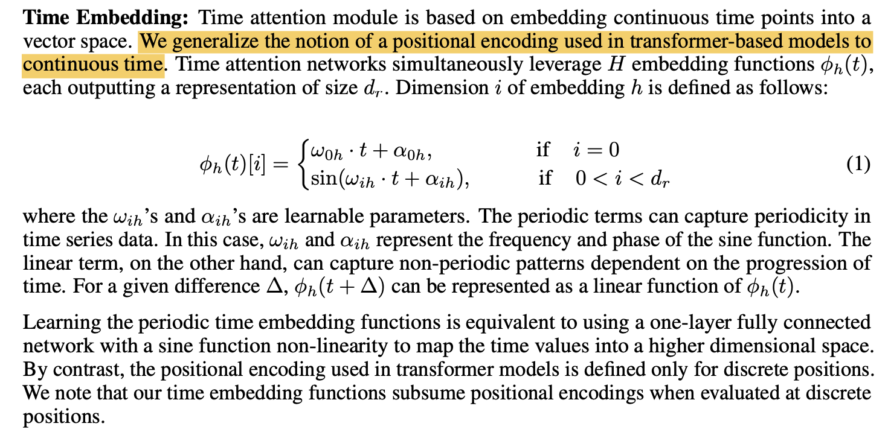
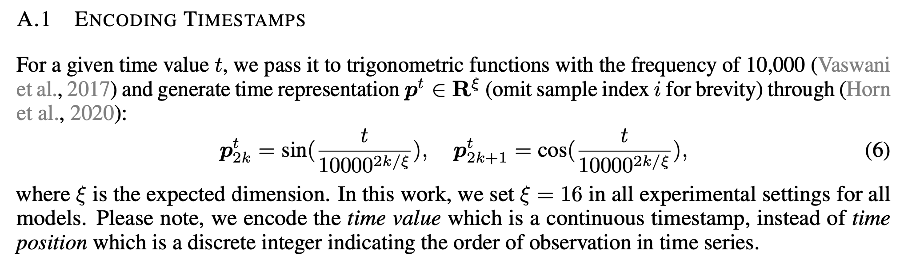
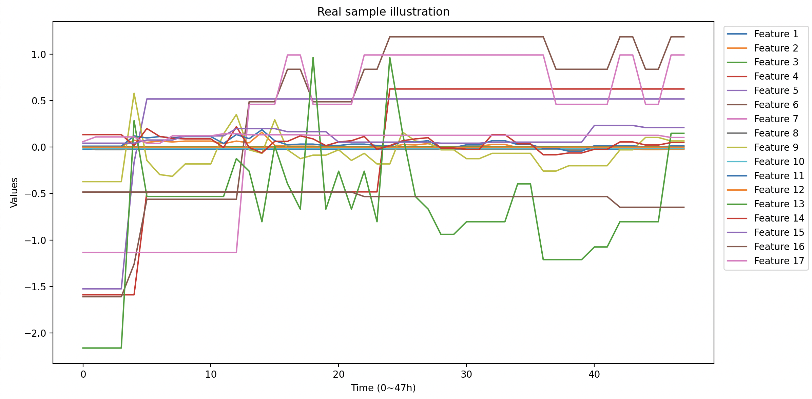
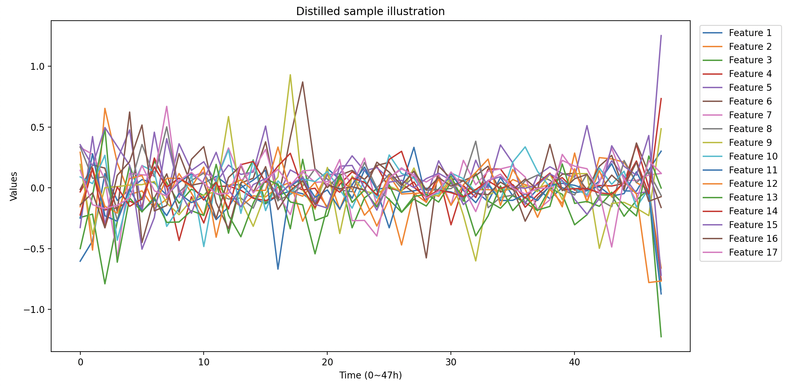

# Time Series Distillation with Transformers

Experiment on mimic3 benchmark multitask set.

Run these preprocessing scripts first:

```shell
cd src
python preprocess.py -n mimic3benchmark -d ../data/mimic3/benchmark/multitask/ --sr 1.0
```

Preprocessed data saved as `./data/mimic3/benchmark/multitask/saves/train/20240214-*.pkl` and `./data/mimic3/benchmark/multitask/saves/test/20240214-*.pkl`.

Some output statistics:

| split | dataset size (#episodes) | valid size | max ts length | avg ts length | std ts length |
| ----- | ------------------------ | ---------- | ------------- | ------------- | ------------- |
| train | 35621                    | 35571      | 2804          | 87.27         | 124.23        |
| test  | 6281                     | 6273       | 1993          | 88.85         | 127.70        |

## Length of stay regression preliminary

Do a time-step-wise regression on remaining length of stay.

Data collate manner:

- A batch consists of N sample features, key_padding_masks, masks and labels
- Key_padding_masks: for each sample, positions (time steps) marked as a padding (True in boolTensor) will not attend attention
- Masks: for each sample, only positions marked as 1 will contribute to the learning / eval loss (in other words, a valid data point). This mainly comes from mimic3 benchmark preprocessings

Learner model arch:

Transformer (encoder-only):

- Max_seq_len = 320 (~mu+2sigma)
- Mimic3 benchmark has 17 features, so input dim = 17
- Each feature token will then be embedded into embed_dim = 64
- 3 layers, with 4 heads, possibly dropout = 0.1
- A **regressor to map latent vector into a number**
- Every attention layer is futher masked by a triu causal matrix that prevent previous time steps from attending later positions, so that **the model learns a latent representation at each time step that encodes all previous information**

Training criterion: MSE loss; Eval metric: MSE loss averaged over each time step


## In hospital mortality classification preliminary

All same as previous, except in transformer, instead of a regressor there's a forward layer mapping into 2-dim logit vector for binary classification.

Training criterion: CE loss; Eval metric: CE loss and AUROC score

Observed overfitting. Best eval AUROC ~0.82.

Efforts trying to make the performance align with reported in benchmark paper (unitask ~0.86, multitask ~0.87)

Firstly, **make sure the test set is normalized using the same stats as in training set.**

Then, do a hyperparameters search:

| slurm id     | num_layers | num_heads | embed_dim | dropout | lr   | wd   | best epoch | best test auroc |
| ------------ | ---------- | --------- | --------- | ------- | ---- | ---- | ---------- | --------------- |
| 19134073     | 3          | 4         | 32        | 0.1     | 1e-3 | 1e-3 | 60         | 0.8555          |
| 19134218     | 3          | 4         | 64        | 0.1     | 1e-3 | 5e-4 | 60         | 0.8578          |
| 19134259     | 3          | 4         | 32        | 0.1     | 1e-3 | 5e-4 | 77         | **0.8605**      |
| 19134296     | 2          | 2         | 32        | 0.1     | 1e-3 | 5e-4 | 80         | 0.8596          |
| 19134511     | 4          | 4         | 32        | 0.1     | 1e-3 | 5e-4 | 85         | **0.8607**      |
| 19134537     | 3          | 4         | 32        | 0.1     | 1e-3 | 1e-4 | 21         | 0.8596          |
| 19135203     | 3          | 4         | 32        | 0.2     | 1e-3 | 1e-4 | 38         | **0.8613**      |
| 19159827     | 3          | 4         | 32        | 0.2     | 1e-3 | 1e-4 | 34         | **0.8616**      |
| **19286460** | 3          | 4         | 32        | 0.3     | 1e-3 | 1e-4 | 53         | **0.8630!!**    |
| 19287365     | 3          | 4         | 32        | 0.5     | 1e-3 | 1e-4 | 61         | **0.8612**      |
| 19289511     | 3          | 4         | 32        | 0.2     | 1e-3 | 5e-4 | 89         | **0.8616**      |
| 19313189     | 3          | 4         | 32        | 0.3     | 1e-3 | 5e-4 | 95         | 0.8580          |

## Vanilla (multitask) dataset distillation

LOS task loss is extremely large and when its weight is not 0 nan will occur in both model parameters and learnable synthetic data. So temporarily except this task, considering only the rest 3.


Evaluation (by train-on-synthetic, eval-on-real) at some distillation epochs:

Train epoch 10:

---------Results----------
Eval samples: 3235
Eval loss: 0.0027
Eval AUROC score: **0.7516**

## Distillation: single tasks (2/28~)

### IHM

slurm-a100.sh and slurm.sh:

```
python -u main.py distill --method vanilla --tasks ihm
```

The experiments:

- 19875567: on A100

  ```
  @dataclass
  class VanillaDistillConfig:
      n_samples: int = 1 # number of synthetic samples
      batch_size_syn: int = 1
      batch_size_real: int = 256 # minibatch size of real datasets
      max_seq_len: int = 320
      num_heads: int = 4
      num_layers: int = 3
      embed_dim: int = 32
      n_inner_steps: int = 50
      n_epochs: int = 100
      lr_data: float = 1e-3
      wd_data: float = 1e-4
      init_lr_model: float = 1e-3
      lr_lr_model: float = 1e-3
      min_lr_model: float = 1e-5
      ihm_w: float = 1
      los_w: float = 0 # TODO
      pheno_w: float = 0
      decomp_w: float = 0
  ```

- 19875566: inner loops 50 -> 10 (make it possible to run on gpu with less memory)
- 19875577: on A100,  inner loops 50 -> 10, n samples 1 -> 10

### LOS

```
python -u main.py distill --method vanilla --tasks los
```

- 20053180: 1 sample, 50 inner loop
- 20179715: same, but on a100 (more epochs)

### PHENO

```
python -u main.py distill --method vanilla --tasks pheno
```

- 20053181: 1 sample, 50 inner loop
- 20179724: same, but on a100 (more epochs)

### DECOMP

```
python -u main.py distill --method vanilla --tasks decomp
```

- 20053186: 1 sample, 50 inner loop
- 20179726: same, but on a100 (more epochs)


## Timestamp encoding (3/6~)

To prepare the un-resampled dataset, run these preprocessing scripts first:

```shell
cd src
python preprocess.py -n mimic3benchmark -d ../data/mimic3/benchmark/multitask/
```

Preprocessed data saved as `./data/mimic3/benchmark/multitask/saves/train/20240319-*.pkl` and `./data/mimic3/benchmark/multitask/saves/test/20240319-*.pkl`.

Some output statistics:

| split | dataset size (#episodes) | valid size | max ts length | avg ts length | std ts length |
| ----- | ------------------------ | ---------- | ------------- | ------------- | ------------- |
| train | 35621                    | 35571      | 44018         | 134.47        | 462.63        |
| test  | 6281                     | 6273       | 5516          | 133.95        | 238.04        |

### tAPE ([arxiv 2305.16642](https://arxiv.org/pdf/2305.16642))






| num_layers | num_heads | embed_dim | dropout | lr   | wd   | best epoch | best test auroc |
| ---------- | --------- | --------- | ------- | ---- | ---- | ---------- | --------------- |
| 3          | 4         | 32        | 0.3     | 1e-3 | 1e-4 | 63         | **0.8612**      |

### Learnable Stamp Embedding

- [A Transformer-based Framework for Multivariate Time Series Representation Learning](https://arxiv.org/abs/2010.02803): assume timeseres are regularly sampled, PE for each position is learnable parameters

- [Informer](https://arxiv.org/pdf/2012.07436.pdf): granularize time stamp and give a learnable embedding to each of the grain

  

My attempt: granularize / indexing timestamp by 1 hour (48 embeddings for ihm) and replace the APE with the learned TE.

Train on mimic3 benchmark - ihm for 100 epochs:

| Mode                             | num_layers | num_heads | embed_dim | dropout | lr   | wd   | best epoch | best test auroc |
| -------------------------------- | ---------- | --------- | --------- | ------- | ---- | ---- | ---------- | --------------- |
| TE only                          | 3          | 4         | 32        | 0.3     | 1e-3 | 1e-4 | 94         | **0.8241**      |
| TE + APE (within the same grain) | 3          | 4         | 32        | 0.3     | 1e-3 | 1e-4 | 88         | **0.8223**      |

A fatal disadvantage for distilling: **granularization is not differentiable**

### Common limitations

– imputation is still inevitable.

### Latest Continuous Timestamp Embedding (used in mTAND, Raindrop, etc)

From now on to simplify the problem, only consider IHM binary classification task

#### 1 mTAND's

– All sinusoids (except for first dimension which is a linear mapping), each with different **learnable** angular frequencies and phase shifts.



Modeling:

| num_layers | num_heads | embed_dim | dropout | lr   | wd   | best epoch | best test auroc |
| ---------- | --------- | --------- | ------- | ---- | ---- | ---------- | --------------- |
| 3          | 4         | 32        | 0.3     | 1e-3 | 1e-4 | 95         | **0.8554**      |

 Distilling (vanilla method):

```
@dataclass
class VanillaDistillConfig:
    n_samples: int = 20 # number of synthetic samples in total. for now, only considering 
    batch_size_syn: int = 20
    batch_size_real: int = 256 # minibatch size of real datasets
    max_seq_len: int = 320
    num_heads: int = 4
    num_layers: int = 3
    embed_dim: int = 32
    n_inner_steps: int = 50
    n_epochs: int = 100
    lr_data: float = 1e-3
    wd_data: float = 1e-4
    init_lr_model: float = 1e-3
    lr_lr_model: float = 1e-3
    min_lr_model: float = 1e-5
    ihm_w: float = 1
    los_w: float = 0 # TODO
    pheno_w: float = 0
    decomp_w: float = 0
```

Eval AUROC = **0.7206**

#### 2 Raindrop's

– Simply replace sample index $i$ with a continious scalar timestamp $t$.



Modeling:

| num_layers | num_heads | embed_dim | dropout | lr   | wd   | best epoch | best test auroc |
| ---------- | --------- | --------- | ------- | ---- | ---- | ---------- | --------------- |
| 3          | 4         | 32        | 0.3     | 1e-3 | 1e-4 | 71         | **0.8620**      |

 Distilling (vanilla method):

```
@dataclass
class VanillaDistillConfig:
    n_samples: int = 20 # number of synthetic samples in total. for now, only considering 
    batch_size_syn: int = 20
    batch_size_real: int = 256 # minibatch size of real datasets
    max_seq_len: int = 320
    num_heads: int = 4
    num_layers: int = 3
    embed_dim: int = 32
    n_inner_steps: int = 50
    n_epochs: int = 100
    lr_data: float = 1e-3
    wd_data: float = 1e-4
    init_lr_model: float = 1e-3
    lr_lr_model: float = 1e-3
    min_lr_model: float = 1e-5
    ihm_w: float = 1
    los_w: float = 0 # TODO
    pheno_w: float = 0
    decomp_w: float = 0
```

Eval AUROC = **0.7896**

### A visualized analysis of distilled time series (by far)





Distilled data is not interpretable / explanable at all.

**Do we need more control?** (in some way similar to L2 norm regularization)

