# Experiment Log 10.11~

## 1 Overall plan

### 1.1 Current stage

- Choose a well studied downstream task (mortality prediction, length-of-stay prediction), select features, form a sub-dataset by joining tables and filtering (refer to [MIMIC docs](https://mimic.mit.edu/docs/iv/))
- Build an NN for it (better easy to perform DD on, e.g. temporal convolutional network)
- Get a distilled dataset **that has the same structure as the original selected sub-dataset**
- Evaluate the DD on traditional classifiers as well as NN on the same objective

### 1.2 Future work

- Try different DD strategies
- Explore how to perform DD with traditional classifiers

## 2 Preliminary verification

### 2.1 Problem setup

- **Objective**: In-hospital mortality prediction based on the first 48hr of an ICU stay

- **Data**: ~20 selected features (variables), all in tabular format, from MIMIC (III or IV)

- **Motivation**:

  - Mainly inspired by the foundamental benchmark study on MIMIC-III: [H. Harutyunyan et al. - Multitask learning and benchmarking with clinical time series data (2019)](https://www.nature.com/articles/s41597-019-0103-9)

  - Mortality is a primary outcome of interest in acute care: ICU mortality rates are the highest among hospital units (10% to 29% depending on age and illness), and early detection of at-risk patients is key to improving outcomes

  - The study selected out only **17** variables for all the 4 tasks, including mortality prediction, which is a relatively simple selected sub-dataset

    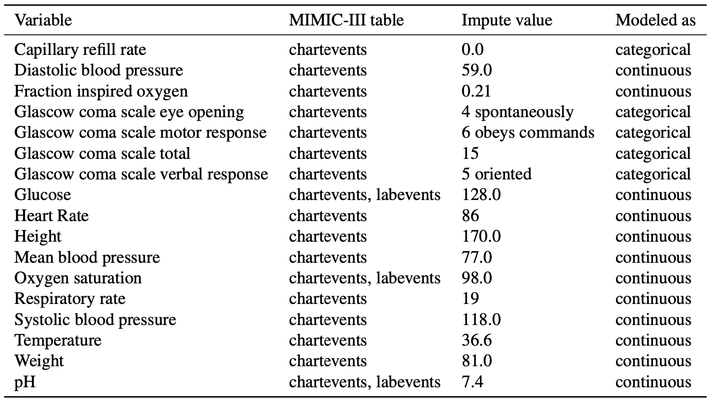

  - For MIMIC-III, H. Harutyunyan et al. provided the code base; doing the similar thing on MIMIC-IV should not be too hard

### 2.2 Data processing

#### 2.2.1 Feature selection

Useing the exact same pipeline of H. Harutyunyan et al., we have:

- **Size**

  - ~18k training subjects / stays

  - ~3k evaluating subjects / stays

- **Format**

  - Episodes (ICU stays) of **time series** of 48hr events, without a fixed sample rate (new timestamp is added each time a new lab/chart event happens)

    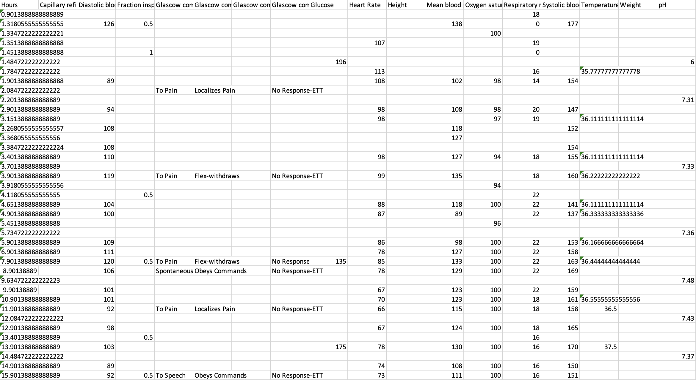

  - Episode-level information (patient age, gender, ethnicity, height, weight) and outcomes (mortality, length of stay, diagnoses) are also available

- **Balance**
  - ~86% negative (safe)
  - ~14$ positive (mortality)

#### 2.2.2 Preprocess

1. Resample: just like in the original paper, **resample** the timeseries to a fixed sample rate (1h), so that the length is unified
2. Recover missing variables: recover by **imputation **(forward filling), add mask columns for each feature column, representing whether the datapoint is imputed or real
3. Normilize each column using **Z-score normalization**
4. Each tensor is sized 48 (time steps) * 59 (num features, mask columns included)

### 2.3 Model

Mainly 2 types models to do the binary classification:

- `1DCNN`: 1-D CNN, with 2 conv layers and 2 fc layers (given that the temporal data has 1-D translational invariance)
- `MLP`: 3 fc layers

### 2.4 Experiments

#### 2.4.1 Model capacity verification

This stage is to verify whether the dataset is good, and whether the model trained on train set can generalize onto test set.

Training setup:

- lr = 0.001
- Optimizer = Adam
- Epoch = 100
- Data = unbalanced

On both models, test loss stops to decrease within 3 epochs, and then rise all the way up, which points to **severe overfitting**.

Pick the best performing epoch (overall acc ~90%), generate a classfication report, on a **balanced test set**:

1DCNN:

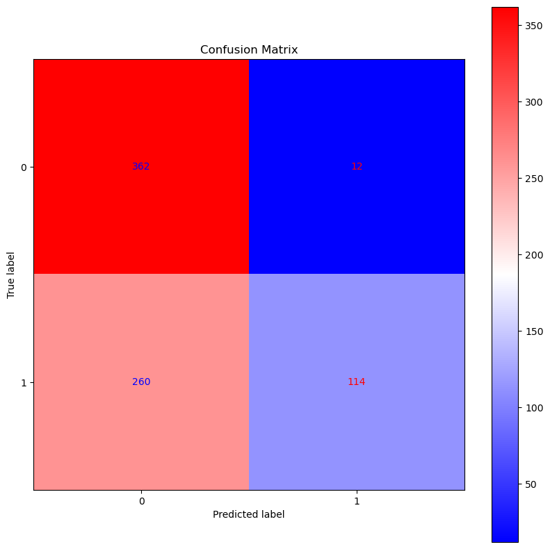

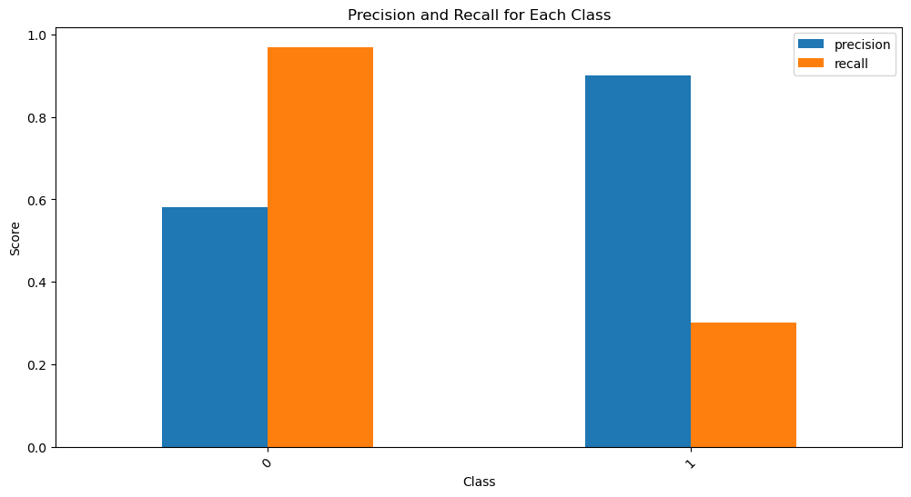

MLP:

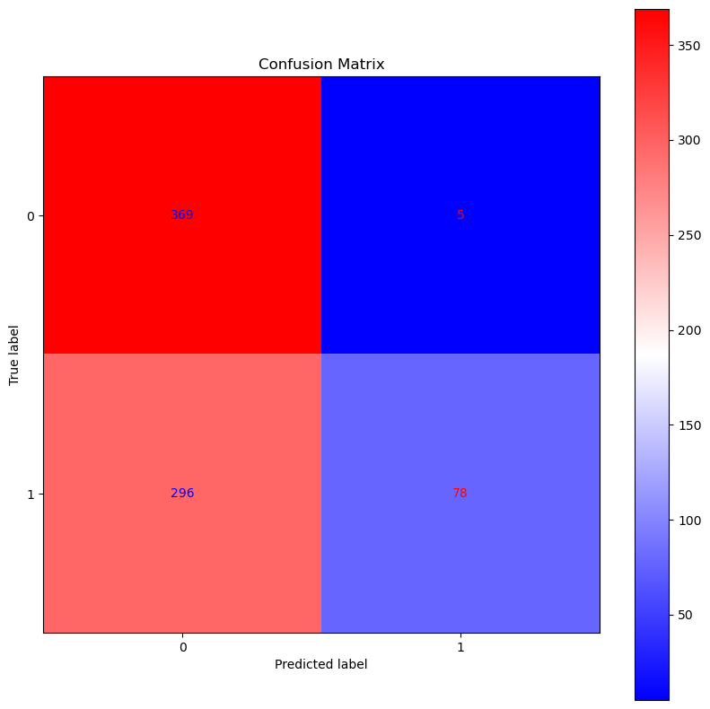

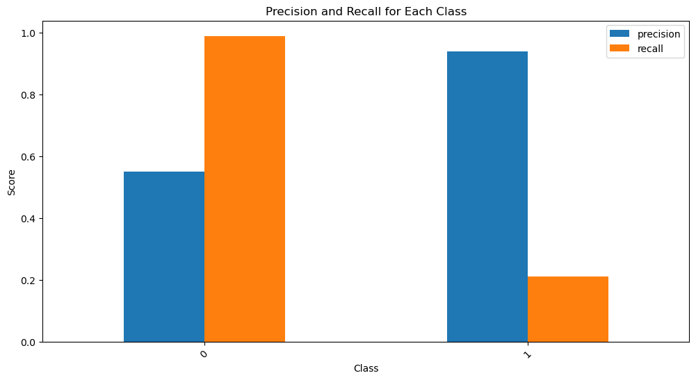

##### Further moves

- After configuring `weight_decay` to Adam (which allows L2 regularaztion), the overfitting is postponed, but not improving the best performance on test set (loss ~0.27)

- After taking out mask columns from training data, performance is slightly better (loss ~0.26)

- Also tried **training on balanced training set** and **evaluating on balanced test set** (by under-sampling)

  - Test acc is up to ~72%, which better than random guess for binary classification, but not impressive
  - Still suffer from overfitting: test loss starts to rise at around epoch 3

  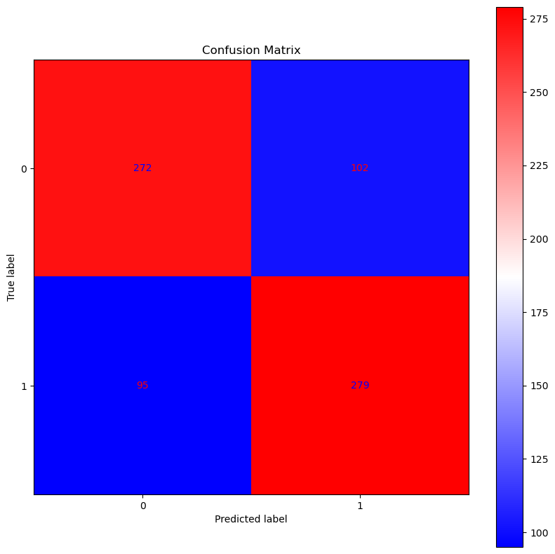

  

- Turn on mask again (with balance + mask), test acc is improved to ~75%
- AUC-ROC for metric

##### Observation summary

- Models generally suffer from overfitting
- Maybe the data itself just isn't good enough

#### 2.4.2 Synthetic dataset distillation

Distilled dataset using Matching Gradients, 100 iterations.

Evaluate by:

- Train 2 models simultaneously, syn model trained on synthetic dataset, and real model trained on real dataset (balanced)
- Both models are evaluated (computing loss and accuracy) on real dataset after each epoch
- Compare both models' performance
- Result: syn model isn't learning anything, acc near 0.5 (random guess)

##### Vanilla method

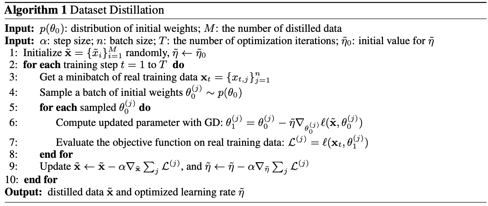

##### All latest experiment results

| Model | Train set size        | Distillation method | Traini settings                         | Eval on                      | AUROC         | Comment                                                      |
| ----- | --------------------- | ------------------- | --------------------------------------- | ---------------------------- | ------------- | ------------------------------------------------------------ |
| 1DCNN | Original (15480+2424) | -                   | Optim=Adam, lr=1e-3, wd=1e-3            | Original test set (2862+375) | 0.8340        | Best performance (lowest eval loss) occurs in the first 5 epochs |
| MLP   | Original (15480+2424) | -                   | Optim=Adam, lr=1e-3, wd=1e-3            | Original test set (2862+375) | 0.8296        | Best performance occurs in the first 5 epochs                |
| 1DCNN | 20 (10+10)            | Random sample       | Optim=Adam, lr=1e-3, wd=1e-3            | Original test set (2862+375) | 0.6980 (avg4) | Best performance occurs in the first 5 epochs                |
| MLP   | 20 (10+10)            | Random sample       | Optim=Adam, lr=1e-3, wd=1e-3            | Original test set (2862+375) | 0.7191 (avg4) | Best performance occurs in the first 5 epochs                |
| 1DCNN | 100(50+50)            | Random sample       | Optim=Adam, lr=1e-3, wd=1e-3            | Original test set (2862+375) | 0.7539 (avg4) | Best performance occurs in the first 10 epochs               |
| MLP   | 100(50+50)            | Random sample       | Optim=Adam, lr=1e-3, wd=1e-3            | Original test set (2862+375) | 0.7646 (avg4) | Best performance occurs in the first 10 epochs               |
| 1DCNN | 500(250+250)          | Random sample       | Optim=Adam, lr=1e-3, wd=1e-3            | Original test set (2862+375) | 0.7693 (avg4) | Best performance occurs in the first 20 epochs               |
| MLP   | 500(250+250)          | Random sample       | Optim=Adam, lr=1e-3, wd=1e-3            | Original test set (2862+375) | 0.7817 (avg4) | Best performance occurs in the first 20 epochs               |
| 1DCNN | 20(10+10)             | Vanilla             |                                         | Original test set (2862+375) | 0.5421        |                                                              |
| 1DCNN | 20(10+10)             | Matching gradient   | ol=10, il=50, lr_data=1e-3, lr_net=1e-3 | Original test set (2862+375) | 0.5177        |                                                              |
| 1DCNN | 100 (50 + 50)         | Matching gradient   | ol=10, il=50, lr_data=1e-3, lr_net=1e-3 | Original test set (2862+375) | 0.5353        |                                                              |
|       |                       |                     |                                         |                              |               |                                                              |
|       |                       |                     |                                         |                              |               |                                                              |
|       |                       |                     |                                         |                              |               |                                                              |
|       |                       |                     |                                         |                              |               |                                                              |

#### 2.4.3 Methodology verification on image distillation (11.15~)

To verify the distillation methods as well as to grasp a basic idea of what a successful distilliation process will look like, adjust the codes for image distillation and test on MNIST / CIFAR10.

##### Exp. 1 Vanilla method on MNIST (fixed init)

Settings:

- **NUM_SAMPLES_PER_CLS = 10**
- **NUM_OPTIM_IT = 10000**
- EVAL_INTERVAL = 100
- INIT_LR = 0.001
- MINIMUM_LR = 1e-5
- STEP_SIZE = 0.001
- INIT_WEIGHTS_DISTR = "kaiming"
- **FIX_INIT_WEIGHTS = True**
- NUM_SAMPLED_NETS_TRAIN = 16
- NUM_SAMPLED_NETS_EVAL = 4
- NUM_SAMPLES_PER_CLS = 10

Original randomly initialized synthetic dataset:

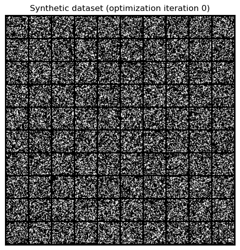

Synthetic dataset when training terminates:

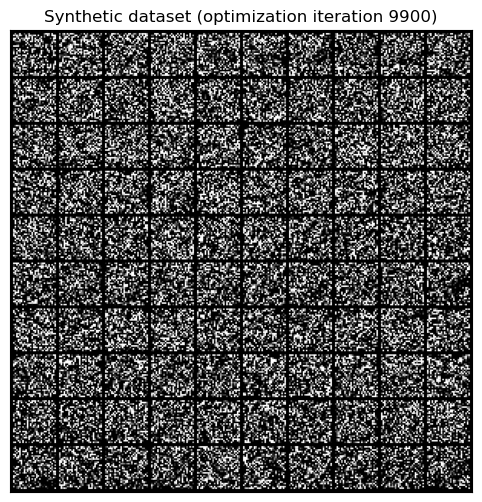

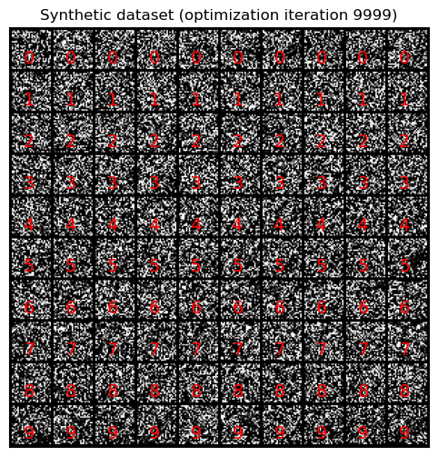

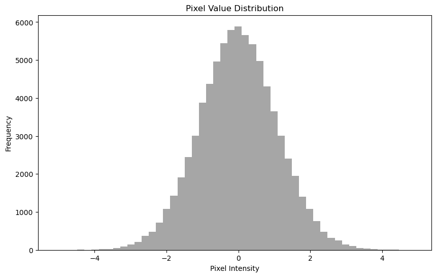

Training curves:

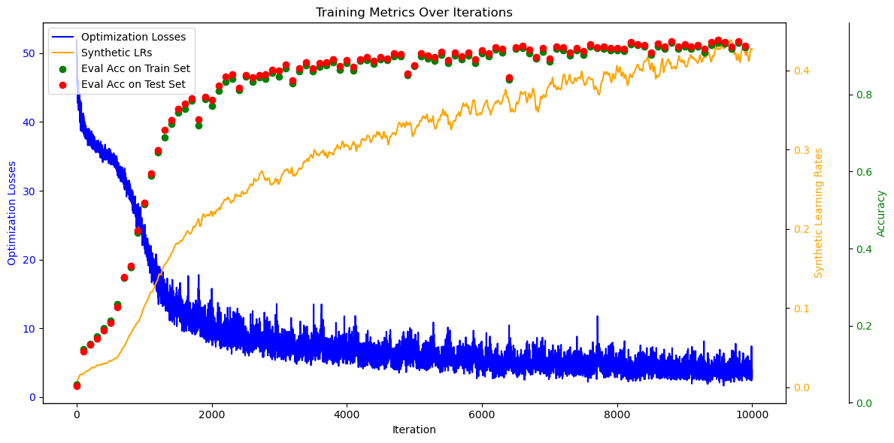

Evaluating on training set and test sets (train the model for one epoch using synthetic data and learnt LR):

|                   | Train set  | Test set   |
| ----------------- | ---------- | ---------- |
| Accuracy (before) | 0.0273     | 0.0225     |
| Accuracy (after)  | **0.9371** | **0.9424** |

Conclusions:

- Possible reasons why previous experiments (on EHR) was not working:
  - Distilled data was not fully trained
- Fixed initialization results in noisy, unrecognizable distilled images
- Distilled images' pixels are not bounded within [-1, 1]

##### Exp. 2 Vanilla method on MNIST (random kaiming init)

Settings:

- **NUM_SAMPLES_PER_CLS = 10**
- NUM_OPTIM_IT = 10000
- EVAL_INTERVAL = 100
- INIT_LR = 0.001
- MINIMUM_LR = 1e-5
- STEP_SIZE = 0.001
- **INIT_WEIGHTS_DISTR = "kaiming"**
- **FIX_INIT_WEIGHTS = False**
- NUM_SAMPLED_NETS_TRAIN = 16
- NUM_SAMPLED_NETS_EVAL = 4
- NUM_SAMPLES_PER_CLS = 10

Original randomly initialized synthetic dataset:

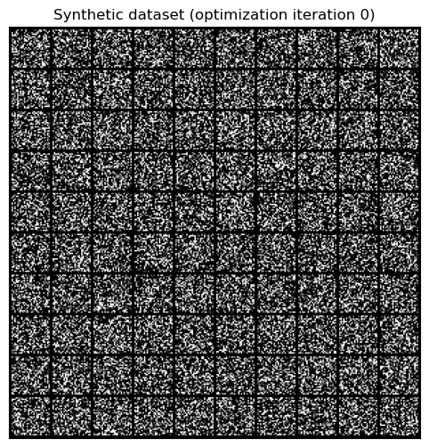

Synthetic dataset when training terminates:

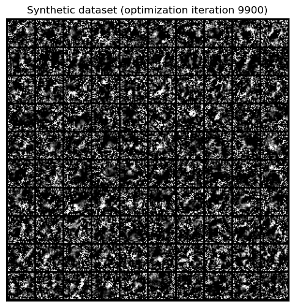

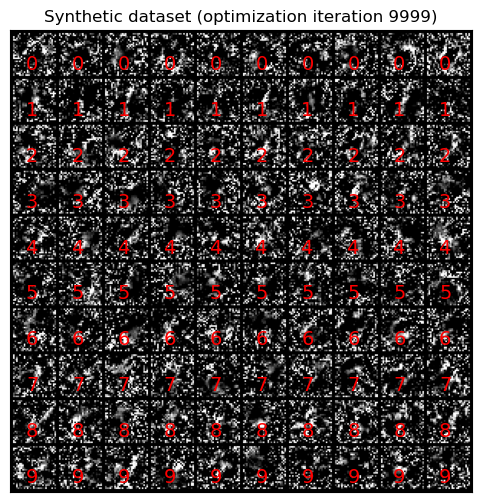

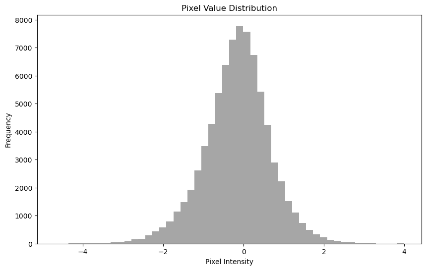

Training curves:

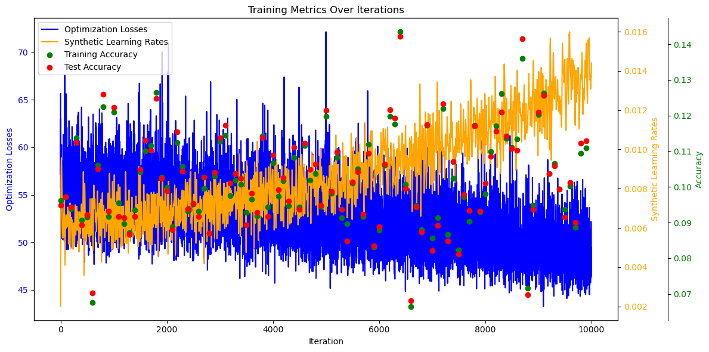

Evaluating on training set and test sets (train the model for one epoch using synthetic data and learnt LR):

|                   | Train set  | Test set   |
| ----------------- | ---------- | ---------- |
| Accuracy (before) | 0.0989     | 0.0979     |
| Accuracy (after)  | **0.1145** | **0.1136** |

Conclusions:

- We are seeing recognizable patterns in the distilled images! (Look at the '1's)
- Training isn't (computational) efficient and full, but it is working! Perhaps more iterations is needed
- Will it benefit if we start from random real samples?

##### Exp. 3 Vanilla method on MNIST (random kaiming init, init syn img from real samples, more it)

Settings:

- **NUM_SAMPLES_PER_CLS = 10**
- **FROM_REAL_SAMPLES = True**
- **NUM_OPTIM_IT = 100000**
- **EVAL_INTERVAL = 1000**
- INIT_LR = 0.001
- MINIMUM_LR = 1e-5
- STEP_SIZE = 0.001
- **INIT_WEIGHTS_DISTR = "kaiming"**
- **FIX_INIT_WEIGHTS = False**
- NUM_SAMPLED_NETS_TRAIN = 16
- NUM_SAMPLED_NETS_EVAL = 4
- NUM_SAMPLES_PER_CLS = 10

Original randomly initialized synthetic dataset:

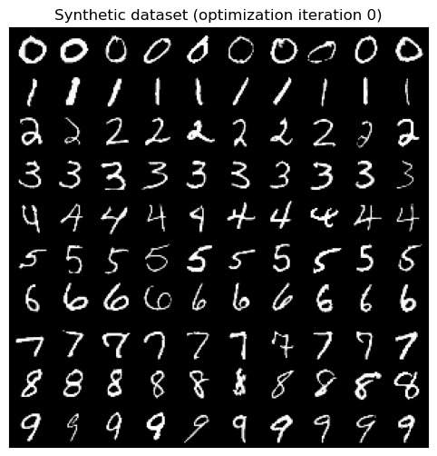

Synthetic dataset when training terminates (remote cluster session timed-out when it=31000...):

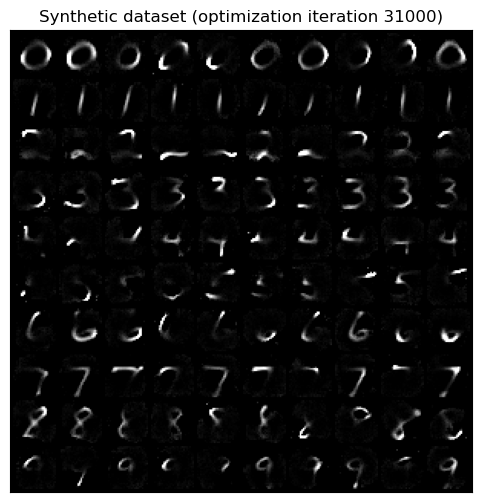

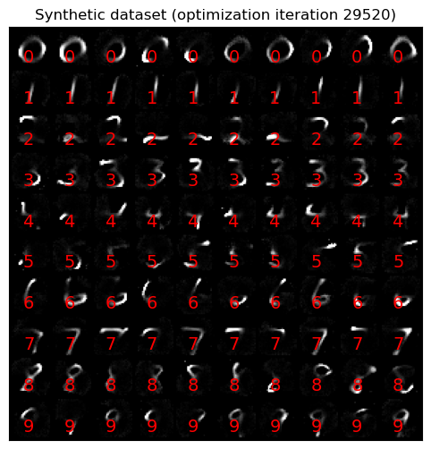

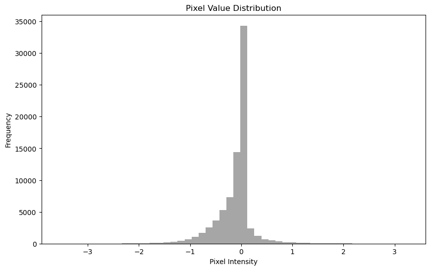

Training curves:

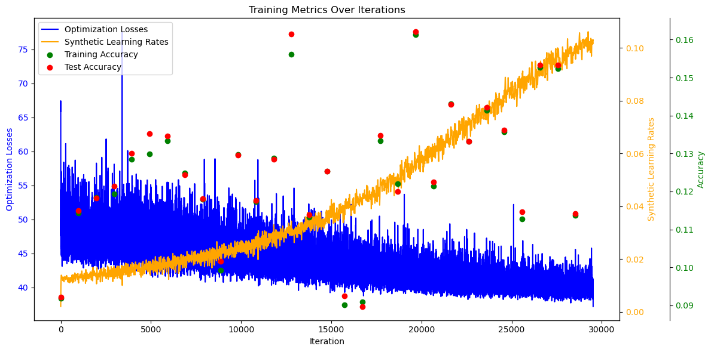

Evaluating on training set and test sets (train the model for one epoch using synthetic data and learnt LR):

|                   | Train set  | Test set   |
| ----------------- | ---------- | ---------- |
| Accuracy (before) | 0.0910     | 0.0910     |
| Accuracy (after)  | **0.1550** | **0.1559** |

Conclusions:

- Patterns are fading away (look at the pixel distribution, values very close to 0 are dominant). Why is that?

  This is what a initial synthetic dataset randomly sampled from real images will look like:

  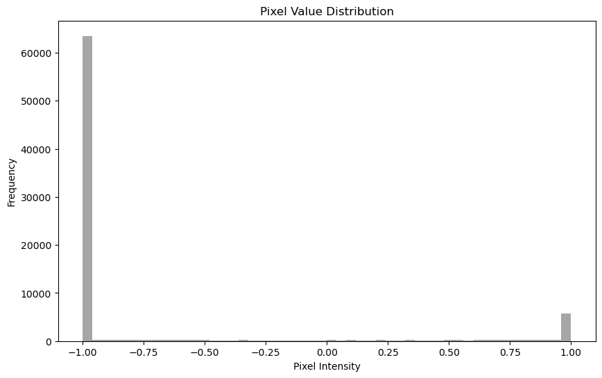

  Does that mean when pixels are 0, it won't be updated any more? **NO: the synthetic data will only be "frozen" if one of the images is all 0, making the optimization step nilpotent**

- Training isn't efficient

##### Exp. 4 Gradient matching on MNIST

Settings:

- model: LeNet (originally ResNet)
- NUM_OUTER_LOOPS = 1000
- EVAL_INTERVAL = 20
- EVAL_NUM_EPOCHS = 50
- NUM_SAMPLED_NETS_EVAL = 4
- **LR_DATA = 0.01** # original: 0.1
  - Note that in original paper (and code) there's no clamping on synthetic image pixels, setting this too large will make the pixel values explode really quickly to NaN
  - To avoid such explosion, I clamp the synthetic image pixels to range [-1, 1] after every iteration
- LR_NET = 0.01 # original: 0.01
- NUM_INNER_LOOPS = 10
- NUM_UPDT_STEPS_DATA = 1 # s_S
- NUM_UPDT_STEPS_NET = 50 # s_theta
- BATCH_SIZE_REAL = 256
- BATCH_SIZE_SYN = 256
- INIT_WEIGHTS_DISTR = "kaiming"
- FIX_INIT_WEIGHTS = False

Original randomly initialized synthetic dataset:

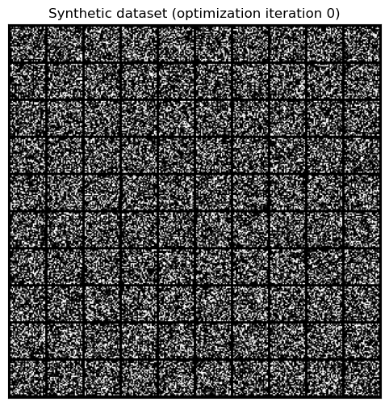

Synthetic dataset when training terminates:

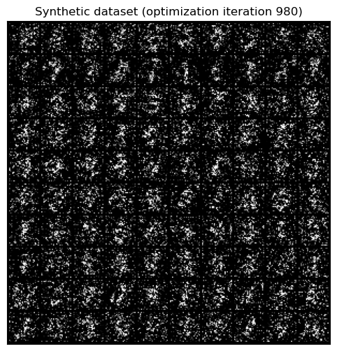

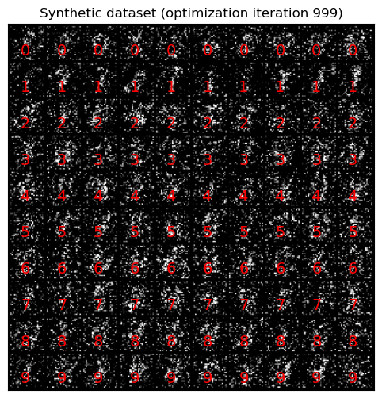

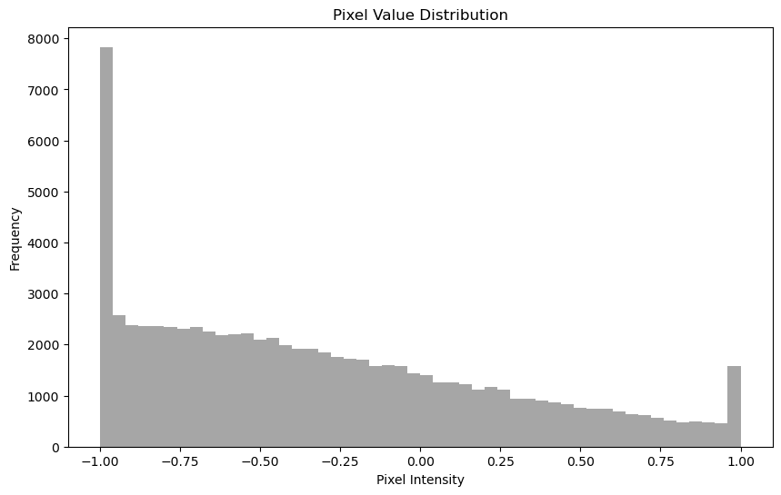

Training curves:

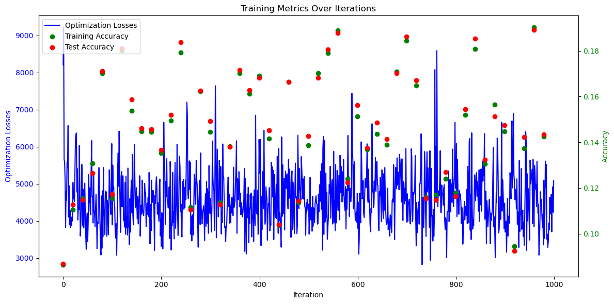

Evaluating on training set and test sets (train the model for as many as possible epochs using synthetic data and a good optimizer, see the training curves):

|                   | Train set  | Test set   |
| ----------------- | ---------- | ---------- |
| Accuracy (before) | 0.1016     | 0.1010     |
| Accuracy (after)  | **0.2342** | **0.2387** |

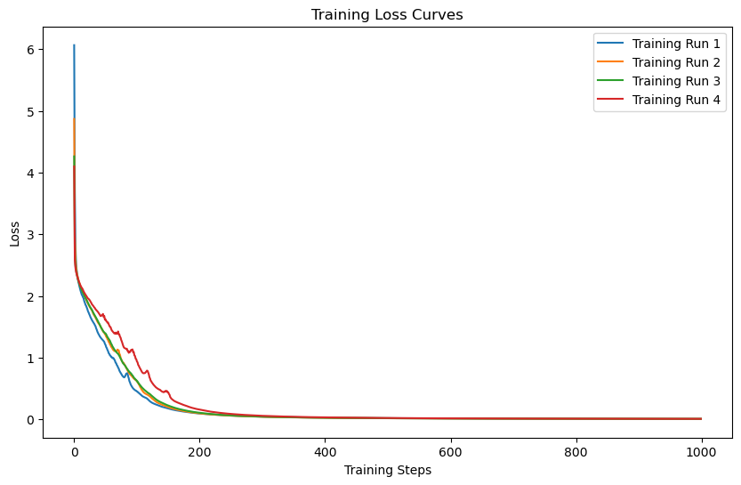

Conclusions:

- This seems to be a promising method, with not bad training complexity, and visible / recognizable patterns in results
- However, how the original authors dealt with "pixel value explosion" is not clear
- I observed very rapid pixel value explosion, and from the very beginning stage of the training, the optimization seems to stop
  - Maybe it's because I used a relatively simple network (LeNet instead of ResNet)
- Need more experiments to get this working!

Next step:

Replicate gradient matching codes, see the actual training process, run distillation over binary classification
