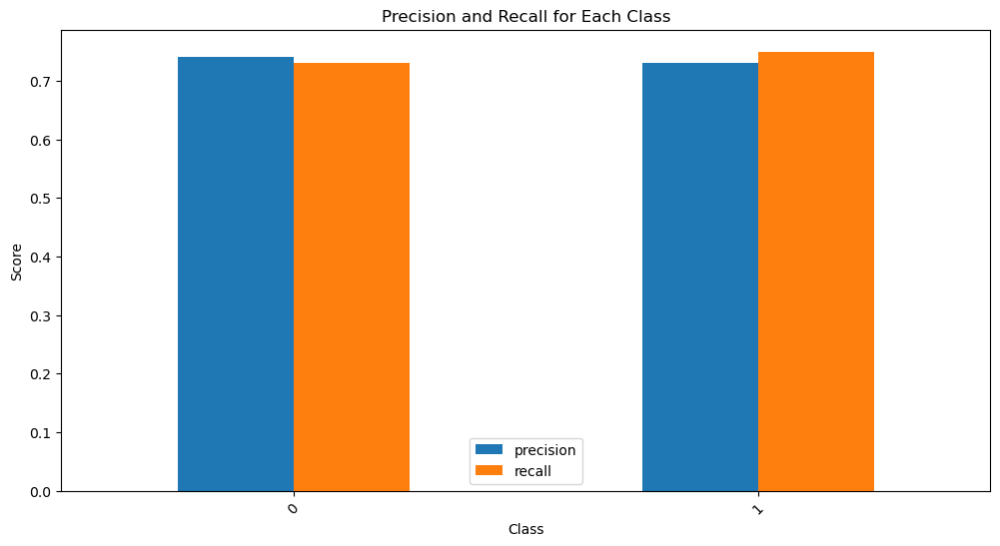

# Experiment Log 10.11~

## 1 Overall plan

### 1.1 Current stage

- Choose a well studied downstream task (mortality prediction, length-of-stay prediction), select features, form a sub-dataset by joining tables and filtering (refer to [MIMIC docs](https://mimic.mit.edu/docs/iv/))
- Build an NN for it (better easy to perform DD on, e.g. temporal convolutional network)
- Get a distilled dataset **that has the same structure as the original selected sub-dataset**
- Evaluate the DD on traditional classifiers as well as NN on the same objective

### 1.2 Future work

- Try different DD strategies
- Explore how to perform DD with traditional classifiers

## 2 Preliminary verification

### 2.1 Problem setup

- **Objective**: In-hospital mortality prediction based on the first 48hr of an ICU stay

- **Data**: ~20 selected features (variables), all in tabular format, from MIMIC (III or IV)

- **Motivation**:

  - Mainly inspired by the foundamental benchmark study on MIMIC-III: [H. Harutyunyan et al. - Multitask learning and benchmarking with clinical time series data (2019)](https://www.nature.com/articles/s41597-019-0103-9)

  - Mortality is a primary outcome of interest in acute care: ICU mortality rates are the highest among hospital units (10% to 29% depending on age and illness), and early detection of at-risk patients is key to improving outcomes

  - The study selected out only **17** variables for all the 4 tasks, including mortality prediction, which is a relatively simple selected sub-dataset

    

  - For MIMIC-III, H. Harutyunyan et al. provided the code base; doing the similar thing on MIMIC-IV should not be too hard

### 2.2 Data processing

#### 2.2.1 Feature selection

Useing the exact same pipeline of H. Harutyunyan et al., we have:

- **Size**

  - ~18k training subjects / stays

  - ~3k evaluating subjects / stays

- **Format**

  - Episodes (ICU stays) of **time series** of 48hr events, without a fixed sample rate (new timestamp is added each time a new lab/chart event happens)

    

  - Episode-level information (patient age, gender, ethnicity, height, weight) and outcomes (mortality, length of stay, diagnoses) are also available

- **Balance**
  - ~86% negative (safe)
  - ~14$ positive (mortality)

#### 2.2.2 Preprocess

1. Resample: just like in the original paper, **resample** the timeseries to a fixed sample rate (1h), so that the length is unified
2. Recover missing variables: recover by **imputation **(forward filling), add mask columns for each feature column, representing whether the datapoint is imputed or real
3. Normilize each column using **Z-score normalization**
4. Each tensor is sized 48 (time steps) * 59 (num features, mask columns included)

### 2.3 Model

Mainly 2 types models to do the binary classification:

- `1DCNN`: 1-D CNN, with 2 conv layers and 2 fc layers (given that the temporal data has 1-D translational invariance)
- `MLP`: 3 fc layers

### 2.4 Experiments

#### 2.4.1 Model capacity verification

This stage is to verify whether the dataset is good, and whether the model trained on train set can generalize onto test set.

Training setup:

- lr = 0.001
- Optimizer = Adam
- Epoch = 100
- Data = unbalanced

On both models, test loss stops to decrease within 3 epochs, and then rise all the way up, which points to **severe overfitting**.

Pick the best performing epoch (overall acc ~90%), generate a classfication report, on a **balanced test set**:

1DCNN:

MLP:

##### Further moves

- After configuring `weight_decay` to Adam (which allows L2 regularaztion), the overfitting is postponed, but not improving the best performance on test set (loss ~0.27)

- After taking out mask columns from training data, performance is slightly better (loss ~0.26)

- Also tried **training on balanced training set** and **evaluating on balanced test set** (by under-sampling)

  - Test acc is up to ~72%, which better than random guess for binary classification, but not impressive
  - Still suffer from overfitting: test loss starts to rise at around epoch 3

  

  

- Turn on mask again (with balance + mask), test acc is improved to ~75%
- AUC-ROC for metric

##### Observation summary

- Models generally suffer from overfitting
- Maybe the data itself just isn't good enough

#### 2.4.2 Synthetic dataset distillation

Distilled dataset using Matching Gradients, 100 iterations.

Evaluate by:

- Train 2 models simultaneously, syn model trained on synthetic dataset, and real model trained on real dataset (balanced)
- Both models are evaluated (computing loss and accuracy) on real dataset after each epoch
- Compare both models' performance
- Result: syn model isn't learning anything, acc near 0.5 (random guess)

##### Vanilla method

##### All latest experiment results

| Model | Train set size        | Distillation Method | Settings                     | Eval on                      | AUROC  | Comment                                        |
| ----- | --------------------- | ------------------- | ---------------------------- | ---------------------------- | ------ | ---------------------------------------------- |
| 1DCNN | Original (15480+2424) | -                   | Optim=Adam, lr=1e-3, wd=1e-3 | Original test set (2862+375) | 0.8340 | Best performance occurs in the first 10 epochs |
| MLP   | Original (15480+2424) | -                   | Optim=Adam, lr=1e-3, wd=1e-3 | Original test set (2862+375) | 0.8296 | Best performance occurs in the first 10 epochs |
|       |                       |                     |                              |                              |        |                                                |

