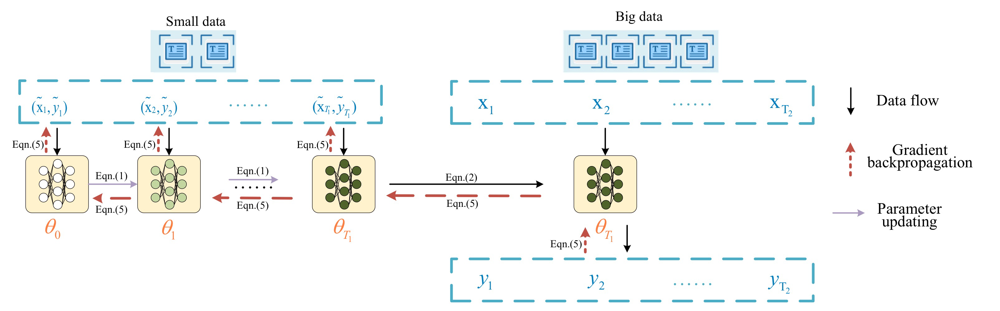

# Literature review about DD 10/4~10/10

## 1 Dataset Distillation

### 1.1 Literature review

#### Paper A: [Dataset Distillation (2018)](https://arxiv.org/abs/1811.10959)

The first-of-its-kind study on MNIST and CIFAR-10 dataset distillation.

##### Main idea

3 steps:

1. Train a batch of models initialized from a random distribution for one step on the synthetic dataset (randomly initialized images);
2. Evaluate them on the real dataset and get the loss;
3. Backward the loss by computing the loss's gradient with respect to the synthetic dataset

##### Results

#### Paper B: [New Properties of the Data Distillation Method When Working With Tabular Data (2020)](https://arxiv.org/abs/2010.09839)

An examination of the algorithm proposed in A on tabular data.

Actually, "tabular data" here refers to a 2-dimensional binary classification dataset made up by the authors. It is limited in terms of generalizability and not even close to the form of medical tabular data in EHR datasets.

#### Paper C: [Dataset Distillation for Medical Dataset Sharing (2023)](https://r2hcai.github.io/AAAI-23/pages/accepted-papers.html)

Aiming at medical data sharing, this one uses dataset distillation method by matching network parameters to synthesize a COVID-19 CXR dataset.

##### Main idea

3 steps:

1. Teacher-student architecture training: Train a teacher model on original data, init student model with parameters in the teacher model at a random step, and train the student on distilled dataset for some steps;
2. Dataset distillation with parameter pruning: match the parameters of teacher and student, prune hard-to-match prameters, and count a **contrastive loss** from the two models' parameters;
3. Optimized COVID-19 CXR dataset generating: back propagate gradients through all student model updates, all the way to the pixels of distilled dataset.

##### Limitations

1. They didn't validate the distilled dataset on other model structures;

2. They didn't generalize the method to other datasets;

3. Result images are hard to interpret (my observation). 

   

##### My thoughts here

If distilled (synthesized) dataset is **neither interpretable, nor can be used to train different structures**, then what's the point of sharing such a dataset? Why not simply share the pretrained model parameters? Is it possible to make the distilled data **understandable or generalizable** when we consider time-series data?

#### Paper D: [Data Distillation for Text Classification(2021)](https://arxiv.org/abs/2104.08448)

This is the first-of-its-kind on text data distillation.

It basically follows the same principles in A.

However, the so-called "distilled" dataset here contains only numeric matrices that are supposed to represent text (maybe aligned to the embedding space of the embedding model used here), but the authors didn't try to make it interpretable.

#### Paper E: [Dataset Condensation with Gradient Matching (2021)](https://arxiv.org/abs/2006.05929) (and an [improved version](https://proceedings.mlr.press/v139/zhao21a.html) from the same authors)

This paper re-formulate the goal of DD as a **gradient matching** problem between the gradients of deep neural network weights that are trained on the original and synthetic data, see in paper's paragraph 2.2.

##### Main idea

The core idea is to minimize the differences between the **(curriculum) gradients** of the teacher and the student in **every step of SGD training**, after noticing 2 defects in parameter-matching methods.

Architecture:

Optimization goal:

Can be simplified into:

##### Results

Comparison to coreset methods:

Comparison to vanilla DD:

Interestingly, this method generalizes well on other model strutures:

The qualitative results are even more interesting: the images synthesized using this method look way more interpretable than those out of vanilla DD.

#### Paper F: [Dataset Condensation with Distribution Matching (2023)](https://arxiv.org/abs/2110.04181) (and its [improved version](https://arxiv.org/abs/2307.09742) which I haven't been through yet)

Latest study from the same authors of E, proposing that Instead of matching some properties (e.g. gradients) during the training process, matching the **features outputted from neural networks** can be a better idea.

> While we match the mean features of the real and synthetic image batches, E matches the mean gradients of network weights over the two batches. We find that, given a batch of data from the same class, the mean gradient vector w.r.t. each output neuron in the last layer of a network is equivalent to a weighted mean of features where the weights are a function of classification probabilities predicted by the network and proportional to the distance between prediction and ground-truth. In other words, while our method weighs each feature equally, E assigns larger weights to samples whose predictions are inaccurate. Note that these weights dynamically vary for different networks and training iterations. 

Counterintuitively, the chosen neural networks here are not pre-trained ones, but randomly initialized ones (basically they just act as a tool to lower the dimension of images).

> The family of embedding functions ψθ can be designed in different ways. Here we use a deep neural network with different random initializations rather than sampling its parameters from a set of pre-trained networks which is more computationally expensive to obtain. We experimentally validate that our random initialization strategy produces better or comparable results with the more expensive strategy of using pretrained net- works in Section 3.4. However, one may still question why randomly initialized networks provide meaningful embeddings for distribution matching. Here we list two reasons based on the observations from previous work. First, randomly initialized networks are reported to produce powerful representations for multiple computer vision tasks. Second, such random networks are showed to perform a distance-preserving embedding of the data, *i.e*. smaller distances between samples of same class and larger distances across samples of different classes. In addition, the combination of many weak embeddings provides a complete interpretation of the inputs.

##### Results

Obviously they got competitive results compared to E (DC in the chart, and DSA is its improved version), while preserving the somewhat interpretability of the synthetic images.

They also examined the parameter distributions used to map images into features, focusing on whether well-trained networks will end up with better results:

Quantitative results are similar, while qualitative results (images) seem better indeed.

And they argued that:

> Regularizing the images to look real may limit the data-efficiency.

Which means **a trade-off between interpretability and effectiveness** of the synthetic data may need to be considered.

#### #TODO Paper G: [Cross-Domain Missingness-Aware Time-Series Adaptation With Similarity Distillation in Medical Applications (2020)](https://ieeexplore.ieee.org/abstract/document/9167415?casa_token=zMeonPgGqqwAAAAA:kOVHpkXos0BUzAcLPnT_QQVcUmsd5cumMXF1egfVwdVl3sMWOrjUIA8KBs8bMBC6PMnOwqQ7)

#### #TODO Paper H: [Communication-Efficient Federated Skin Lesion Classification with Generalizable Dataset Distillation (2023)](https://workshop2023.isic-archive.com/paper_tian.pdf)

### 1.2 Summary

#### Methodology categories

- **A/B/D**: essentially by making random initialized synthetic data "learnable weights", train on them, then evaluate on original data to get a loss, finally propagate gradients all the way back to the data themselves (**train on synth, eval on origin**);
- **C**: teacher-student architecture, loss is got by **matching** the teacher's and student's **weights**;
- **E**: teacher-student architecture, loss is got by **matching** the teacher's and student's **gradients after every training step**;
- **F**: loss is got by simply **matching** the output **features (embedded images)** from **randomly initialized neural networks**.

#### Opportunities

- Indeed, there is no previous research regarding time-series data distillation, especially medical time-series; we will be the first-of-its-kind;
- Previous works didn't pay enough attention to make the distilled dataset interpretable or generalizable, which makes the motivation for distilled dataset sharing seem not that strong.

#### Challenges

- How do we distill generalizable /interpretable data?
- More specifically, how do we approach the EHR time-series data? Text (through embedding) or numeric vectors (from their literal values)? Images are straightforward (pixels = numerics, and basically you can "see the numbers" directly), but tabular /time-series are not, they even vary in size.

